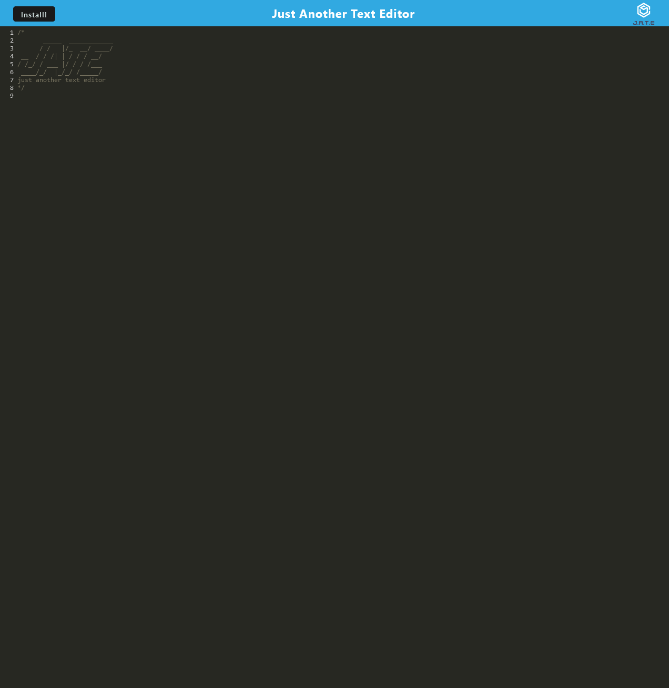

# Jate

## Purpose
Built as a Progressive Web App (PWA), this app is a simple note taker, where you can write down thoughts and come back to them or write code as an example. You can intall it with the install button found on the header.

## Built With
* Express
* Webpack

## Install
* Clone the repo
* Install dependencies with `npm install`
* Run the build with `npm run build`
* Start the server with `npm start`
* Take notes!

## Links
[Deployed App](http://radiant-spire-72294.herokuapp.com/)